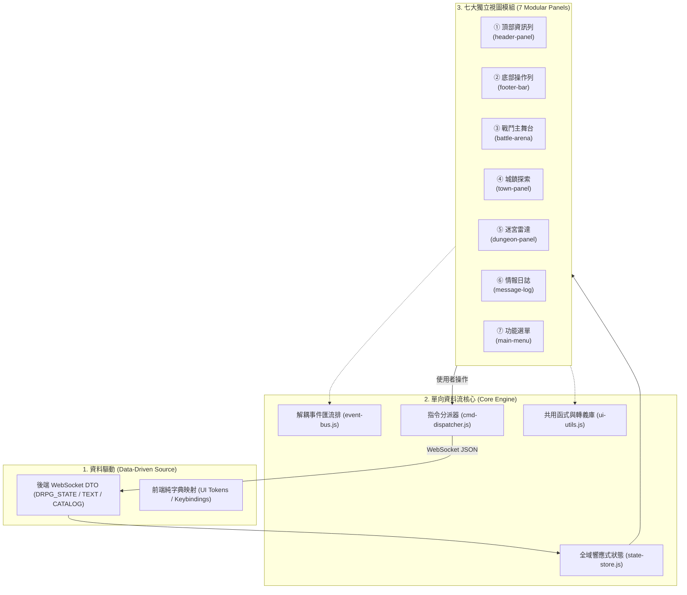
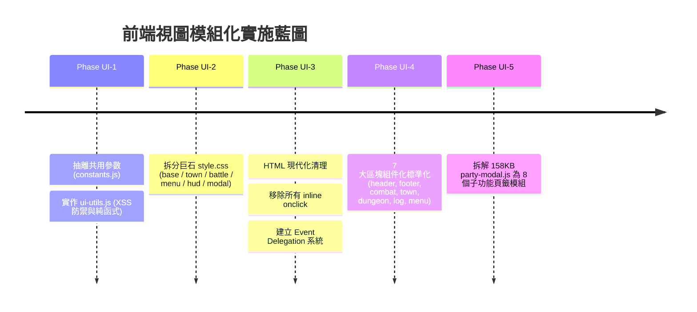

# 🖥️ 前端頁面結構與視圖模組化架構規範書
# (Frontend Page Architecture, 7 Core Modules & Data-Driven Specifications)

> **文件定位**：  
> 本文件作為專案所有 Web 前端視圖（HTML5 / Vanilla CSS / ES6 模組）的**最高架構規範與頁面結構藍圖**。  
> 旨在確立**「共用參數與函式抽離」、「7 大功能區塊嚴格模組化」**以及**「100% 資料驅動 (Data-Driven，杜絕前端寫死)」**三大核心鐵律，並詳實記錄專案畫面的現況、缺陷盤點與演化里程碑。

---

## 📌 目錄 (Table of Contents)

1. [核心架構哲學與三大開發鐵律](#1-核心架構哲學與三大開發鐵律)
2. [共用核心參數與共用函式庫規格](#2-共用核心參數與共用函式庫規格)
3. [7 大核心視圖模組化規格](#3-7-大核心視圖模組化規格)
   - [3.1 頂部資訊列 (Header / Global Navigation)](#31-頂部資訊列-header--global-navigation)
   - [3.2 底部操作列 (Footer / Context Action Bar)](#32-底部操作列-footer--context-action-bar)
   - [3.3 戰鬥交鋒主舞台 (Combat / Battle Arena)](#33-戰鬥交鋒主舞台-combat--battle-arena)
   - [3.4 城鎮生活與探索 (Town & World Exploration)](#34-城鎮生活與探索-town--world-exploration)
   - [3.5 迷宮地牢第一人稱探索 (Dungeon Radar & Exploration)](#35-迷宮地牢第一人稱探索-dungeon-radar--exploration)
   - [3.6 沉浸文字與情報日誌 (Message Log & Intelligence)](#36-沉浸文字與情報日誌-message-log--intelligence)
   - [3.7 功能選單 (Main Menu / DQ & FF Modal)](#37-功能選單-main-menu--dq--ff-modal)
4. [專案畫面實際現況深度盤點 (Current UI State)](#4-專案畫面實際現況深度盤點-current-ui-state)
5. [資料驅動 (Data-Driven) 違規項目與整治規範](#5-資料驅動-data-driven-違規項目與整治規範)
6. [未來推進階段計畫 (Roadmap & Phases)](#6-未來推進階段計畫-roadmap--phases)
7. [前端架構師建議 (Architect Recommendations)](#7-前端架構師建議-architect-recommendations)

---

## 1. 核心架構哲學與三大開發鐵律



### 鐵律一：嚴格資料驅動 (Strict Data-Driven)
- **禁止在 JS/CSS 中硬編碼任何遊戲業務規則**：包括但不限於角色職業名稱、武器部位限制、物品類別、顏色代碼、數值加成、技能標籤、怪物類型。
- **UI 僅負責投影 (Projection)**：所有標籤（如「正宗道法」、「不可名狀」）、品階色彩、按鈕狀態、可用性判定，必須直接取自後端 DTO 或由後端 metadata 宣告。

### 鐵律二：抽離共用參數與純粹函式 (Shared Utils & Constants)
- 杜絕重複造輪子與隨意複製：所有數值格式化、安全轉義、血量真元百分比換算、CSS 類別合成、鍵盤代碼映射，必須收納至 `core/constants.js` 與 `core/ui-utils.js`。
- **無狀態與純函式**：共用 Util 函式不得持有內部狀態，輸入確定則輸出確定。

### 鐵律三：全面消除 Inline JS 與高特異性 CSS
- HTML 結構中**嚴格禁止出現 `onclick="..."`、`onkeypress="..."` 等內聯屬性**。
- 所有互動行為一律透過資料屬性（`data-action="..."`、`data-target="..."`）搭配**事件委派 (Event Delegation)** 綁定。
- 樣式嚴格基於 CSS 變數（CSS Tokens），禁止以 inline style 覆蓋版面或尺寸。

---

## 2. 共用核心參數與共用函式庫規格

為終結目前程式庫中常數散落、工具重複定義之現況，前端共用底座規劃為兩大模組：

### 2.1 全域常數設定中樞 (`static/js/core/constants.js`)

```javascript
/**
 * 前端全域靜態常數定義 (禁止硬編碼散落)
 */
export const UI_CONSTANTS = Object.freeze({
  // 字級安全下限 (杜絕破版)
  MIN_FONT_SIZE_PX: 13,
  
  // 日誌最大留存行數
  MAX_LOG_HISTORY_LINES: 200,

  // 主選單 DQ/FF 規格
  MENU: {
    MAX_ITEMS_PER_PAGE: 20,
    BASE_WIDTH: 1600,
    BASE_HEIGHT: 900
  },

  // 快捷鍵定義 (Key Codes)
  KEYS: {
    MENU: ['c', 'C', 'p', 'P'],
    BAG: ['b', 'B'],
    INSPECT: ['i', 'I'],
    REST: ['r', 'R'],
    CONSOLE: ['`', '~'],
    ESCAPE: ['Escape'],
    SPACE: [' ']
  },

  // 資源條類型與預設風格 (與後端 CombatResourceType 對齊)
  RESOURCE_THEMES: {
    MP: { label: '真元', cssClass: 'resource-mp', color: 'var(--color-resource-mp)' },
    SP: { label: '戰氣', cssClass: 'resource-sp', color: 'var(--color-resource-sp)' },
    RAGE: { label: '怒氣', cssClass: 'resource-rage', color: 'var(--color-resource-rage)' },
    COMBO: { label: '連擊', cssClass: 'resource-combo', color: 'var(--color-resource-combo)' },
    SAN: { label: '理智', cssClass: 'resource-san', color: 'var(--color-resource-san)' }
  }
});
```

### 2.2 全域共用工具函式庫 (`static/js/core/ui-utils.js`)

```javascript
/**
 * 通用純粹 UI 工具函式
 */
export const UiUtils = {
  /**
   * 1. 全域 DOM XSS 防禦轉義 (P0 安全核心)
   */
  escapeHtml(str) {
    if (str === null || str === undefined) return '';
    return String(str)
      .replace(/&/g, '&amp;')
      .replace(/</g, '&lt;')
      .replace(/>/g, '&gt;')
      .replace(/"/g, '&quot;')
      .replace(/'/g, '&#039;');
  },

  /**
   * 2. 安全百分比計算 (避免除以零或溢出)
   */
  calculatePercentage(current, max) {
    const curVal = Number(current) || 0;
    const maxVal = Number(max) || 1;
    if (maxVal <= 0) return 0;
    return Math.min(100, Math.max(0, Math.round((curVal / maxVal) * 100)));
  },

  /**
   * 3. 資源進度條樣板產生器
   */
  createResourceBar(current, max, type = 'hp') {
    const pct = this.calculatePercentage(current, max);
    return `
      <div class="hud-bar-track hud-bar-${type}">
        <div class="hud-bar-fill" style="width: ${pct}%"></div>
        <span class="hud-bar-text">${current}/${max}</span>
      </div>
    `;
  },

  /**
   * 4. 裝備/技能品質標籤 CSS 類別解析 (完全由後端 tag/quality 驅動)
   */
  getQualityClass(quality) {
    const q = String(quality || 'COMMON').toUpperCase();
    const map = {
      POOR: 'quality-gray',
      COMMON: 'quality-white',
      UNCOMMON: 'quality-green',
      RARE: 'quality-blue',
      EPIC: 'quality-purple',
      LEGENDARY: 'quality-orange',
      MYTHIC: 'quality-red'
    };
    return map[q] || 'quality-white';
  }
};
```

---

## 3. 7 大核心視圖模組化規格

```
┌────────────────────────────────────────────────────────────────────────┐
│ ① 頂部資訊列 (Header / Global Navigation)                              │
├───────────────────────────────────┬────────────────────────────────────┤
│ 視圖主容器 (Context Viewport)     │ ⑥ 沉浸文字與情報日誌               │
│                                   │    (Message Log & Intelligence)    │
│  [依模式切換顯示以下主舞台]       │                                    │
│  ③ 戰鬥交鋒舞台 (Battle Arena)    │    * 100% 全高貫通                 │
│  ④ 城鎮生活探索 (Town Stage)      │    * ANSI 彩色轉義                 │
│  ⑤ 迷宮雷達視窗 (Dungeon Radar)   │    * 平滑自動捲動                 │
│                                   │                                    │
├───────────────────────────────────┴────────────────────────────────────┤
│ ⑦ 統一功能選單 (Main Menu Modal) [固定 1600x900 / 滿版適配，按 C 開啟] │
├────────────────────────────────────────────────────────────────────────┤
│ ② 底部操作列 (Footer / Context Action Bar - 48~64px 模式高頻操作)       │
└────────────────────────────────────────────────────────────────────────┘
```

---

### 3.1 頂部資訊列 (Header / Global Navigation)

- **模組路徑**：`static/js/panels/header-panel.js`
- **對應 HTML 節點**：`<header id="top-nav-bar" class="top-nav-bar">`
- **主要職責**：
  1. 顯示當前探索模式（城鎮／地牢／戰鬥）與地圖名稱（例如：`🏛️ 太陰古塚一層 (B1F)` 或 `🏡 桃源新手村`）。
  2. 承載**道門陣法靈威條**（自小隊 HUD 移至頂部，作為全隊全域戰略資源）。
  3. 提供全域主選單 (C) 快速入口與伺服器 WebSocket 連線品質指示燈。
- **Data-Driven 規範**：
  - 陣法名稱、當前靈威值、最大靈威值完全由 `state.drpgState.formation` 提供。
  - 禁止在 Header 代碼中寫死陣法特效描述。

---

### 3.2 底部操作列 (Footer / Context Action Bar)

- **模組路徑**：`static/js/panels/footer-bar.js`
- **對應 HTML 節點**：`<footer id="bottom-control-panel" class="bottom-control-panel">`
- **主要職責**：
  1. 高度固定為 **48px ~ 64px**，杜絕垂直擠壓上方視口。
  2. **情境化動態渲染高頻動作**：
     - **探索模式 (Town/Dungeon)**：`[📜 選單 (C)]`、`[🎒 行囊 (B)]`、`[🌿 調息 (R)]`、`[⌨️ 終端 (~)]`。
     - **戰鬥模式 (Combat)**：`[Space 全隊集火]`、`[⚡ 陣法奧義 (U)]`、`[🏃 遁地撤退 (Esc)]`、`[⌨️ 終端 (~)]`。
  3. 提供微型熱鍵提示列 (Hint Bar)。
- **Data-Driven 規範**：
  - 陣法奧義按鈕的啟用/禁用（disabled）狀態由 `formation.currentEnergy >= formation.maxEnergy` 動態綁定。
  - 移除舊版重複的「存讀檔」、「陣法」獨立按鈕（統一收攏回功能選單）。

---

### 3.3 戰鬥交鋒主舞台 (Combat / Battle Arena)

- **模組路徑**：`static/js/panels/battle-panel.js`
  - 建議演進子模組：`battle-fx-director.js`（戰鬥演出指揮與浮字）、`battle-enemies-view.js`（敵陣渲染）、`battle-command-dock.js`（戰備指揮台）
- **對應 HTML 節點**：`<section id="battle-arena-panel" class="battle-arena-panel">`
  - 覆蓋式特效層：`<div id="battle-fx-layer" class="battle-fx-layer" aria-hidden="true"></div>`（`pointer-events: none`）
- **主要職責**：
  1. **敵方 5x5 陣列區**：動態排布怪物卡片、血條、目標選取框、集火標記 (Focus)、Buff/Debuff 狀態圖示，敵方蓄力意圖與危險警示。
  2. **純粹交鋒線 (Clash Divider)**：2px 微光視覺隔斷，無多餘文字干擾。
  3. **我方戰備甲板 (Combat Deck - 三欄式佈局)**：
     - **左欄**：所選隊員名稱與動作分類按鈕（基礎攻防、武道絕技、仙道符法）。
     - **中欄**：我方 5x3 戰陣站位幾何網格（嚴格 >= 13px，原位陣亡標記 💀）。
     - **右欄**：所選隊員之四維狀態數值或當前可施放技能網格（含冷卻與消耗）。
  4. **戰鬥動態表現與特效層 (Battle Presentation FX)**：
     - 浮動傷害/治療數字（正交色彩編碼：屬性定色、判定定型，完全閃避不跳 `-0`）。
     - 卡片受擊/暴擊/格擋/招架/閃避動態 class 反饋，殘血倒下過渡動畫。
     - 支援 `@media (prefers-reduced-motion)` 降級。
- **Data-Driven 規範**：
  - 敵我雙方技能圖示、名稱、真元消耗、戰氣消耗、CD 倒數全數取自 `drpgState.battle` 與 `skill` DTO。
  - 嚴禁依怪物名稱判斷是否為 BOSS，一律讀取 `enemy.rank === 'BOSS'` 樣式標籤。
  - 攻擊範圍、命中對象與最終傷害以伺服器結算之 `hits` 陣列為唯一真相來源，前端不可自行推論判定。

---

### 3.4 城鎮生活與探索 (Town & World Exploration)

- **模組路徑**：`static/js/panels/town-panel.js`
- **對應 HTML 節點**：`<section id="town-nav-panel" class="town-nav-panel">`
- **主要職責**：
  1. **頂部環境抬頭**：區域 Badge（`town-zone-badge`）與房間名稱（`town-room-title`）。
  2. **左舞台：3x3 道路方位羅盤**：清晰按鈕佈局（北/南/東/西/特殊傳送），具備出路名稱標註與 WASD 鍵盤支援。
  3. **右舞台：雙列彈性卡片區**：
     - **當前生靈 (NPCs)**：名稱、稱號、互動標籤（交談/招募/交易/切磋）。
     - **地面散落靈物 (Ground Items)**：掉落物清單與一鍵拾取按鈕。
- **Data-Driven 規範**：
  - 房間描述、出口可用性（`exits`）100% 取自伺服器 `TOWN_STATE`。
  - NPC 互動功能由 `capabilities` 陣列動態生成，嚴禁用 if/else 寫死「如果是掌櫃就出商店按鈕」。

---

### 3.5 迷宮地牢第一人稱探索 (Dungeon Radar & Exploration)

- **模組路徑**：`static/js/panels/dungeon-panel.js`
- **對應 HTML 節點**：`<aside id="dungeon-radar-panel" class="dungeon-radar-panel">`
- **主要職責**：
  1. **10x10 ASCII 矩陣迷宮雷達**：支援動態網格渲染、迷霧遮蔽（Fog of War）、玩家座標 `[X, Y]` 與朝向動態箭頭。
  2. **視野模式切換**：居中跟隨 (Center Focus) 與全圖俯瞰 (Global View) 一鍵切換。
  3. **正前方凝神探查卡片**：顯示探查到的暗道、祭壇、寶箱或潛伏生靈。
- **Data-Driven 規範**：
  - 地塊類型標記（牆壁 `#`、空地 `.`、樓梯 `>`、寶箱 `$`）由後端地牢資料矩陣直接定義。

---

### 3.6 沉浸文字與情報日誌 (Message Log & Intelligence)

- **模組路徑**：`static/js/panels/message-log-panel.js`
- **對應 HTML 節點**：`<div class="log-and-battle-area"><section id="log"></section></div>`
- **主要職責**：
  1. **100% 全高貫通右舞台**：專注傳達沉浸劇情、武學出招描寫、NPC 對話與戰鬥反饋。
  2. **ANSI 彩色編碼解析**：經 `AnsiUp` 安全轉換為對應配色。
  3. **日誌容量控制與平滑滾動**：限制最大留存 200 行，新訊息平滑滾動至底。
- **Data-Driven 規範**：
  - 日誌文本中涉及之 `$N` (攻擊者)、`$n` (防守者)、`$W` (兵刃) 等佔位符在後端即已解析完成，前端僅作安全渲染，不介入文字邏輯。

---

### 3.7 功能選單 (Main Menu / DQ & FF Modal)

- **模組路徑**：`static/js/modals/party-modal.js`（後續拆分為 `static/js/modals/main-menu/`）
- **對應 HTML 節點**：`<div id="party-modal" class="modal-overlay">`
- **主要職責**：
  1. 固定 **1600×900 / 滿版安全適配**（按 `C` 或 `P` 開關）。
  2. **左側 8 大功能主導覽列**：
     - `ITEMS`（道具：分類瀏覽、單頁 20 項、分頁翻頁、使用道具）
     - `EQUIP`（裝備：5 人直排紙娃娃點將台 + 槽位點擊觸發兩欄式裝備替換與數值比較子視圖）
     - `SKILLS`（技能&法術：武道/法術分類、主修功法設定、法術書翻頁）
     - `CHARACTERS`（角色：5 位成員詳細數值、四維屬性、道基加點）
     - `PARTY`（隊伍：隊伍名冊順序 `#1~#5` 上移/下移，與戰陣座標解耦）
     - `FORMATION`（陣法：5x3 戰陣盤孔位配置、站位加成、陣法典籍庫）
     - `TACTICS`（戰術方針：FFXII 風格 Gambit 優先序規則鏈配置）
     - `SYSTEM`（系統：多槽位存檔、讀檔、遊戲設定）
- **Data-Driven 規範**：
  - 裝備槽位清單（`WEAPON`, `OFF_HAND`, `HEAD`, `BODY`, `FEET`, `ACCESSORY_1`, `ACCESSORY_2`）取自資料字典。
  - 數值比對差異（綠字增益、紅字衰減）由裝備屬性動態相減計算，不寫死固定屬性名稱。

---

## 4. 專案畫面實際現況深度盤點 (Current UI State)

經過對現行前端程式庫（`index.html`、`style.css`、`app.js`、`panels/`、`modals/`）之全面審查，當前畫面存在以下架構缺陷：

| 檢驗向度 | 現狀數值 / 現象 | 評估風險 | 具體痛點與改進目標 |
| :--- | :--- | :---: | :--- |
| **HTML 內聯事件** | `index.html` 存在 25+ 處 `onclick="..."` | 🔴 高危 | 違反 CSP 安全規範，程式碼與視圖高度偶合，無法進行單元測試。 |
| **CSS 巨石樣式** | 單一 `style.css` 高達 **4,180+ 行 (118 KB)** | 🔴 高危 | 樣式衝突頻繁，特異性 (Specificity) 失控，維護成本極高，亟待按 7 大區塊拆分。 |
| **JS 巨石單體** | `party-modal.js` 高達 **158 KB**<br>`battle-panel.js` 高達 **40 KB** | 🔴 高危 | 單一檔案承擔過多職責（裝備、技能、Gambit、存檔混在一起），違反單一職責原則。 |
| **字級過小破版** | 多處出現 `font-size: 10px ~ 11px` | 🟠 中危 | 早期固定高度排版在提升至 13px 時會產生文字截斷或折行破版，需改用流式 Flex/Grid。 |
| **共用函式混亂** | `mud-core.js` 與 `mud-ui.js` 仍以全域掛載執行 | 🟠 中危 | 未納入 ES6 Modules 管理體系，全域變數污染（如 `window.send`）。 |
| **資源顯示遮蔽** | HUD 僅能顯示 MP 或 SP 二選一 | 🟡 輕微 | 法力與戰氣無法同時在戰鬥中直觀監控，需落地雙軌資源條規格。 |

---

## 5. 資料驅動 (Data-Driven) 違規項目與整治規範

### 5.1 違規實例與修正方案

#### ❌ 違規一：前端以字串名稱猜測物品分類與效果
```javascript
// 【舊版不良寫法 - 硬編碼猜測】
if (item.name.includes("丹") || item.name.includes("茶")) {
    showUseButton = true;
}
```
```javascript
// 【新規範 - 嚴格資料驅動】
if (item.type === "CONSUMABLE" || item.isUsable === true) {
    showUseButton = true;
}
```

#### ❌ 違規二：前端以 NPC 名稱硬編碼互動行為
```javascript
// 【舊版不良寫法】
if (npc.name === "掌櫃" || npc.id === "inn_keeper") {
    renderShopButton();
}
```
```javascript
// 【新規範 - 依 Capabilities 宣告渲染】
if (Array.isArray(npc.capabilities)) {
    npc.capabilities.forEach(cap => renderActionButton(cap.type, cap.label, cap.action));
}
```

#### ❌ 違規三：按鈕顏色與字級使用 Inline Style
```javascript
// 【舊版不良寫法】
html += `<span style="color: #ff0000; font-size: 11px;">破防受創!</span>`;
```
```javascript
// 【新規範 - 採用 Token 類別】
html += `<span class="combat-log-alert font-ui-sm">破防受創!</span>`;
```

---

## 6. 未來推進階段計畫 (Roadmap & Phases)



### 階段一：底座共用層抽取 (Phase UI-1) — Priority: P0 — ✅ 已於 2026-10-02 完成落地
1. 建立 [`src/main/resources/static/js/core/constants.js`](../src/main/resources/static/js/core/constants.js)，收斂鍵盤碼、字級標準（>=13px）、主選單 1600x900 / 20筆每頁、日誌緩衝 200 行上限。
2. 建立 [`src/main/resources/static/js/core/ui-utils.js`](../src/main/resources/static/js/core/ui-utils.js)，實裝高強度 `escapeHtml()`、資源百分比換算與品質色彩對映，並雙向掛載至 `window`。
3. 全面治理並消除 `town-panel.js`、`party-hud-panel.js`、`battle-panel.js`、`bag-drawer.js`、`shop-modal.js`、`skill-drawer.js`、`save-modal.js`、`party-modal.js`、`message-log-panel.js` 中的高危 DOM XSS 拼接漏洞。

### 階段二：樣式庫模組化拆分 (Phase UI-2) — Priority: P1 — ✅ 已於 2026-10-05 完成落地
將原巨石 `style.css` 安全依順序拆分為 6 個連續模組，由 `index.html` 按序載入：
- `css/style-01-tokens-and-shell.css`（色彩、字體、全域 Tokens 與基礎骨架）
- `css/style-02-combat-arena.css`（戰鬥 5x5 敵陣、5x3 戰陣盤）
- `css/style-03-battle-actions.css`（戰鬥按鈕列、技能冷卻）
- `css/style-04-main-menu.css`（1600x900 主選單外框與分頁）
- `css/style-05-town-and-hub.css`（城鎮生活舞台、3x3 羅盤導航）
- `css/style-06-shop-and-responsive.css`（商店彈窗與 `@media` 響應式佈局）

### 階段三：視圖事件委派與內聯清理 (Phase UI-3) — Priority: P1 — ✅ 已於 2026-10-02 完成落地
1. 清除 `index.html` 中全部 `onclick="..."`。
2. 在 `app.js` 實作全局集中式事件委派 (`initEventDelegation()`)，依 `data-action` 觸發相應的 command dispatcher。

### 階段四：7 大區塊生命週期標準化 (Phase UI-4) — Priority: P1
為每個區塊模組定義一致的公開介面契約：
```javascript
export const TownPanel = {
  mount(containerEl) { /* 綁定容器與事件 */ },
  update(townState) { /* 響應狀態更新 (純投影) */ },
  unmount() { /* 清理資源與監聽 */ }
};
```

### 階段五：選單單體解耦 (Phase UI-5) — Priority: P2 — ✅ 已於 2026-10-05 完成落地
將原 159 KB 的 `party-modal.js` 垂直切片拆解為 4 大子頁籤模組與 1 個精簡 Coordinator：
- `modals/party-equipment-tab.js`（裝備穿脫與 Diff 比對）
- `modals/party-skills-tab.js`（武道法術典籍與技能挑選）
- `modals/party-formation-tab.js`（戰術站位盤與陣法庫）
- `modals/party-tactics-tab.js`（Gambit 規則鏈）
- `modals/party-modal.js`（路由導航、生命週期與存讀檔）

---

## 7. 前端架構師建議 (Architect Recommendations)

1. **強制實施純資料投影 (Pure Projection)**：
   - 視圖層永遠只是後端狀態的「映射鏡子」。任何關於「能否施法」、「背包是否已滿」、「陣法是否啟用」的商業邏輯，後端都應計算完畢並直接在 DTO 帶上布林旗標或狀態代碼，前端只管讀值上樣式，杜絕前後端雙重維護規則。
2. **字級底線與防禦佈局 (Defensive Layout)**：
   - 全專案嚴格貫徹 `font-size >= 13px`。遇到內容超長時，依序採用：**1. 獨立視口捲動 (`overflow-y: auto`) ➔ 2. 窄版欄位折疊 ➔ 3. 文字省略號 (`text-overflow: ellipsis`) + Hover Tooltip**。絕不可透過縮小字體至 9~11px 硬塞！
3. **消除非同步競爭與避免整頁重繪 (DOM Performance)**：
   - 戰鬥中每秒可能有多筆 tick 與受擊事件，頻繁 `innerHTML = ...` 會造成輸入焦點丟失與效能卡頓。建議重要組件（如 HP 條、敵方 Buff 圖示）採用局部更新（或只替換數值與 class），維持平滑 60 FPS 戰鬥體驗。
4. **全域無障礙與純鍵盤流暢遊玩 (Keyboard Navigation)**：
   - 本遊戲定位為純文字 MUD 與魂系 DRPG 的結合，老玩家與核心玩家極度仰賴鍵盤操作。必須確保所有 7 大區塊均能透過全鍵盤無縫操作（`WASD` 移動、`1~5` 技能、`Space` 集火、`C` 選單、`Esc` 關閉與退回、`~` 終端）。
