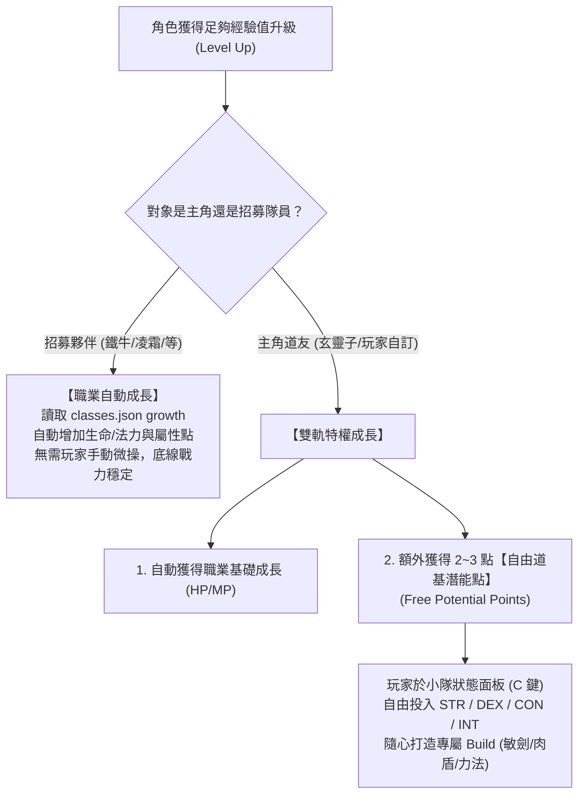
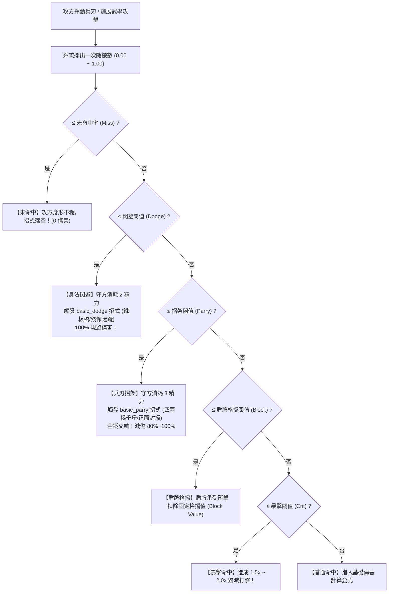

# 戰鬥邏輯、傷害公式、防禦博弈 (Parry/Dodge) 與屬性成長架構規範
# (Combat Resolution, Defense Mechanics & Progression Architecture)

> **文檔定位**：本文件作為遊戲核心戰鬥機制、數值結算與角色成長的永久架構決策紀錄（ADR）。  
> 涵蓋：傷害計算公式、一次擲骰圓桌判定（One-Roll Combat Table）、身法閃避（Dodge）、兵刃招架（Parry）、盾牌格擋（Block）、魂系精力（Stamina）博弈，以及角色等級與屬性成長的混合雙軌制。

---

## 1. 設計哲學與核心目標 (Design Pillars)

1. **結合正統武俠武學與魂系壓迫博弈**：
   - 告別死板的「你打一下、我扣幾點」回合數字互毆。
   - 防禦端具備主動視覺與戰術分層：閃避帶有身法意境（鐵板橋、殘像迷蹤），招架帶有金鐵交鳴（四兩撥千斤、截擊發力點）。
2. **數值與資源雙重博弈**：
   - 閃避與招架並非無成本觸發，消耗「精力 (Stamina)」；若發呆或連續受創導致精力枯竭，將陷入破防狀態，無法閃招。
3. **單人沉浸與小隊管理的最佳平衡**：
   - 5 人隊伍編制下（MAX_PARTY_SIZE = 5），杜絕「每次升級都要幫全隊成員配點」的疲勞微操。
   - 採用「隊員職業自動成長 + 主角專屬自由潛能點」的雙軌制。

---

## 2. 角色屬性與等級成長架構 (Character Stats & Progression)

### 2.1 四大核心基礎屬性 (Core Attributes)

角色底層屬性定義於 `LivingStats.java`，各屬性對戰鬥的實質權重如下：

| 屬性代號 | 屬性名稱 | 核心影響領域 | 戰鬥數值連動公式 |
| :--- | :--- | :--- | :--- |
| **STR** | **力量 (Strength)** | 近戰物理威能、負重上限、兵刃招架成功率 | 提升武器平砍基礎傷害、增加招架機率 (`+0.4%/點`) |
| **DEX** | **靈巧 (Dexterity)** | 命中率、身法閃避率、暴擊率、刺客/弓弩傷害 | 提升攻擊命中率 (`+0.5%/點`)、閃避率 (`+0.8%/點`)、暴擊率 (`+0.5%/點`) |
| **CON** | **體質 (Constitution)** | 氣血上限 (HP)、物理防禦力、抗打擊與耐力 | 提升最大 HP (`+8~15 HP/點`)、提供基礎物理護甲減傷 |
| **INT** | **智力 (Intelligence)** | 法力上限 (MP)、道門法術威力、參悟武學速度 | 提升最大 MP、道術傷害加成、特定神識抗性 |
| *WIS* | *智慧 (Wisdom)* | 精神抗性、治療增幅、理智 (SAN) 穩定度 | 影響醫修治療加成 (`CLERIC`)、抵禦不可名狀狂亂 |

---

### 2.2 混合雙軌升級模式 (Hybrid Progression System)



1. **小隊夥伴（傭兵/NPC）採用「職業自動成長」**：
   - 依據 `classes.json` 中的 `growth` 模板：
     - **戰士 (WARRIOR)**：每級 `hpPerLevel: 30`，屬性權重 `STR: 1.5, CON: 1.2, DEX: 0.5`。
     - **俠客 (SWORDSMAN)**：每級 `hpPerLevel: 20`，屬性權重 `DEX: 1.5, STR: 1.0, INT: 0.5`。
     - **刺客 (ROGUE)**：每級 `hpPerLevel: 18`，屬性權重 `DEX: 2.0, AGI: 1.0, STR: 0.5`。
     - **醫修 (CLERIC)**：每級 `hpPerLevel: 15, mpPerLevel: 15`，屬性權重 `WIS: 2.0, CON: 1.0`。
   - 夥伴升級時由後端自動換算累加，小隊無痛成長。
2. **主角享有「自由潛能點 (Potential)」特權**：
   - 主角每次升級，除獲得基礎職業成長外，額外入帳 **2 點自由潛能點**。
   - 玩家可於狀態介面自由加點，打破職業既定範式。

---

## 3. 戰鬥結算邏輯：一次擲骰圓桌判定 (One-Roll Combat Table)

為杜絕多次擲骰產生的機率偏差與極端無效判定，採用 MMORPG 最權威的 **圓桌判定 (Combat Table)**。一次近戰物理攻擊在 `[0.0, 1.0]` 區間內進行單次擲骰分佈：

```
[--- Miss ---][--- Dodge ---][--- Parry ---][--- Block ---][--- Crit ---][--- Normal Hit ---]
0.0                                                                                      1.0
```

### 3.1 圓桌分佈優先順序與計算公式



---

### 3.2 圓桌各區段詳細規則

#### 1. 未命中 (Miss)
* **意涵**：攻擊者招式落空、偏差或目標距離拉開。
* **判定公式**：
  $$\text{MissChance} = \text{BaseMiss}(5\%) + \max(0, (\text{Def.DEX} - \text{Atk.DEX}) \times 0.5\%)$$
* **保底約束**：物理近戰攻擊最低有 2% 固有未命中機率。
* **戰鬥日誌**：`💨 李逍遙 施展【順勢一劈】攻向 巨大的野鼠，然而招式未及目標，凌厲劍氣擦身掃空！`

#### 2. 身法閃避 (Dodge)
* **意涵**：防守方運用高超身法或戰鬥本能，在被擊中的前一瞬以精妙身姿避開。
* **前置約束**：
  1. 守方氣力值 $\text{Stamina} \ge 2$。
  2. 守方未處於昏迷 (`STUNNED`) 或定身狀態。
* **判定公式**：
  $$\text{DodgeChance} = \text{Skill.dodgeRate}(15\%) + (\text{Def.DEX} \times 0.8\%) + \text{ClassTraitBonus} - (\text{Atk.DEX} \times 0.3\%)$$
* **成功效果**：
  - **100% 免除本次傷害**。
  - 扣除守方 2 點 Stamina。
  - 從 [`basic_dodge.json`](file:///c:/Workspace/my_practice/practice_mud/src/main/resources/data/global/skills/common/basic_dodge.json) 依權重抽取動態招式：
    - `鐵板橋`：「$N上半身毫無徵兆地向後仰倒，呈現鐵板橋的姿勢，$n的$w貼著$N的鼻尖掃過，毫髮無傷。」
    - `殘像迷蹤`：「$N的身形瞬間變得模糊，$n一招擊中了$N留下的殘像，而真身早已退至三尺之外。」
    - `滑步側閃`：「$n手中的$w帶著風聲劈來，$N腳步輕輕一滑，側身讓過了這一擊。」

#### 3. 兵刃招架 (Parry)
* **意涵**：防守方以自身兵器或強健肢體，正面格擋、架開或藉力引偏敵方攻勢。
* **前置約束**：
  1. 守方氣力值 $\text{Stamina} \ge 3$。
  2. 守方主手佩戴近戰武器（劍、刀、槍、棍、斧、匕）或空手拳術精通。
  3. 攻擊類型屬於「近戰物理攻擊」（法術遠程不可招架）。
* **判定公式**：
  $$\text{ParryChance} = \text{Skill.parryRate}(15\%) + (\text{Def.STR} \times 0.4\%) + (\text{Def.DEX} \times 0.4\%) + \text{WeaponParryMod} + \text{ClassTraitBonus}$$
  * *註：俠客 (SWORDSMAN) 天生具備 `parryBonus: +10%`。*
* **成功效果**：
  - **架開敵刃，免受 80% ~ 100% 傷害（可設定為完全免傷或僅受 20% 震盪微傷）**。
  - 扣除守方 3 點 Stamina。
  - 從 [`basic_parry.json`](file:///c:/Workspace/my_practice/practice_mud/src/main/resources/data/global/skills/common/basic_parry.json) 依權重抽取動態演出：
    - `四兩撥千斤`：「$N手腕翻轉，用$W在$n的$w側面輕輕一拍，運用巧勁將攻勢引向身側。」
    - `正面封擋`：「面對$n襲來的$w，$N猛地抬起$W，準確地架住了這一擊，發出一聲沉悶的撞擊聲。」
    - `截擊發力點`：「$N眼疾手快，揮動$W搶在$n招式用老之前，精準地格擋在$n$w的發力點上，半途截斷了攻擊。」
* **進階延伸（破招反擊 Riposte）**：
  - 俠客或裝備特定絕學時，招架成功有 25% 機率即刻觸發一次無消耗的「反手突刺（Counter Strike）」。

#### 4. 盾牌格擋 (Block)
* **意涵**：守方副手佩戴盾牌（`EquipmentSlot.OFF_HAND` 具備 `SHIELD` 標籤），硬抗物理衝擊。
* **判定公式**：
  $$\text{BlockChance} = \text{ShieldBlockRate}(15\% \sim 25\%) + (\text{Def.CON} \times 0.3\%) + \text{WarriorBonus}(5\%)$$
* **成功效果**：
  - 從原始傷害中直接扣除盾牌的「格擋值 (Block Value)」：
    $$\text{FinalDamage} = \max(1, \text{Damage} - \text{ShieldBlockValue})$$
  - 若盾牌格擋值大於傷害，則吸收為 1 點微傷，並於戰鬥日誌呈現重甲金屬盾鳴。

#### 5. 致命一擊 (Critical Strike)
* **判定公式**：
  $$\text{CritChance} = \text{BaseCrit}(5\%) + (\text{Atk.DEX} \times 0.5\%) + \text{RogueBonus}(5\%)$$
* **成功效果**：造成 **150% ~ 200%** 物理或法術傷害，戰鬥日誌高亮黃字標註 `💥【致命一擊】`。

#### 6. 普通命中 (Normal Hit)
* 未被上述任何區間吸收時，進行標準傷害計算。

---

## 4. 傷害結算公式與護甲防禦模型 (Damage Formula)

### 4.1 基礎物理傷害公式

$$\text{RawDamage} = \text{Random}(\text{Weapon.minDmg}, \text{Weapon.maxDmg}) + \left(\frac{\text{Atk.STR}}{2}\right) + \text{SkillBaseDmg}$$

$$\text{SkillModifiedDamage} = \text{RawDamage} \times \text{MoveAction.damageMod}$$

### 4.2 護甲防禦折減 (Armor Mitigation)

採用平滑邊際收益遞減公式（或減法保底公式）：
* **現行公式（減法浮動模型）**：
  $$\text{MitigatedDmg} = \max(1, \text{SkillModifiedDamage} - \text{Def.EffectiveDefense})$$
  $$\text{FinalDmg} = \text{MitigatedDmg} \times \text{RandomVariance}(0.90 \sim 1.10) \times (1.0 - \text{Resistance})$$

### 4.3 魂系精力枯竭懲罰 (Poise Break & Exhaustion)

* 角色 `Stamina` 初始為 100。
* 戰鬥中每秒自然回復 5~10 點。
* **精力枯竭狀態（$\text{Stamina} \le 0$）**：
  1. **防禦崩潰**：閃避率 (Dodge) 與招架率 (Parry) 強制歸零（無法做出身法或架刀）。
  2. **架勢破防 (Stagger / Vulnerable)**：在此狀態下遭受攻擊，受到的傷害額外提升 **20%**，並伴隨「氣力耗盡、步伐渙散」提示。

---

## 5. 模組架構與落地重構藍圖 (Implementation Architecture)

### 5.1 核心介面與類別規劃

```
com.example.htmlmud.domain.combat/
 ├── model/
 │    ├── CombatRollResult.java       // MISS, DODGE, PARRY, BLOCK, CRIT, HIT 列舉
 │    └── CombatResolution.java       // 單次攻擊結算上下文 (Result, FinalDmg, MoveDesc, StaminaCost)
 ├── service/
 │    ├── CombatResolver.java         // 圓桌判定與傷害計算獨立引擎 (Pure Function / 無狀態服務)
 │    └── CombatLogFormatter.java     // 負責將 $N, $n, $W, $w, $l 置換為高品質沉浸文本
```

### 5.2 與雙模戰鬥引擎的整合

1. **`DrpgBattleService.java`（DRPG 地牢戰鬥）**：
   - 隊員攻擊敵怪、敵怪反擊隊員時，統一呼叫 `CombatResolver.resolveAttack(attacker, defender)`。
   - 依據返回的 `CombatRollResult`：
     - 若為 `DODGE`：扣減被擊方 2 精力，調用 `basic_dodge` 招名，輸出免傷日誌。
     - 若為 `PARRY`：扣減被擊方 3 精力，調用 `basic_parry` 招名，輸出格擋日誌。
     - 若為 `HIT/CRIT`：正常扣血並更新 HUD 與狀態廣播。
2. **`CombatService.java`（傳統 MUD / 實體房間戰鬥）**：
   - 替換原先 lines 253-270 的 `// TODO`，無縫共用相同的 `CombatResolver`，達成全域一致性。

---

## 6. 結論與後續實施步驟 (Next Steps)

1. **第一步：建立 `CombatResolver` 核心判定服務**：
   - 實作圓桌一次擲骰演算法。
   - 串接 `basic_dodge.json` 與 `basic_parry.json` 模板資料。
2. **第二步：整合至 `DrpgBattleService` 與 `CombatService`**：
   - 替換目前單純扣血邏輯，加入閃避、招架與精力扣減。
   - 自動化編寫單元測試驗證 Dodge/Parry 觸發與免傷效果。
3. **第三步：升級與自由潛能點配點系統**：
   - 在 `LivingStats` 實裝 `potential` 點數與升級結算。
   - 小隊狀態面板（`C` 鍵）提供自由加點按鈕與即時屬性刷新。
