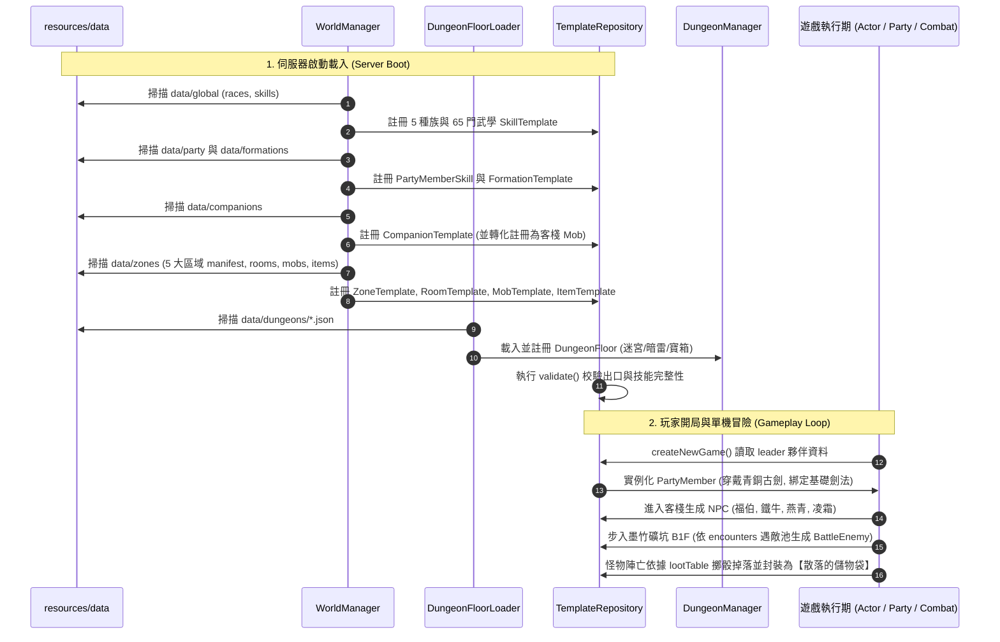

# 專案架構審查：全實體資料驅動 (Data-Driven) 現況與關聯模型

本報告針對專案中所有核心實體（角色、隊員、NPC、怪物、物品、技能、種族、職業、地牢）進行全面審查，確認其是否由 `practice_mud/src/main/resources/data/` 目錄載入，並釐清彼此之間的引用與資料流關聯。

---

## 1. 資料驅動 (Data-Driven) 審查結論總覽

| 實體類別 | 資料驅動狀態 | 資源檔案路徑 (Resource Path) | 核心載入器 / 儲存庫 | 審查細節與邊界條件 |
| :--- | :---: | :--- | :--- | :--- |
| **Zone（區域拓撲）** | ✅ **100% 檔案驅動** | `data/zones/<zone>/manifest.json` | `WorldManager.readZone()`<br>$\to$ `TemplateRepository.registerZone()` | 涵蓋新手村、墨竹礦坑、雪亭鎮、銀葉村、太陰古塚等 5 大區域。 |
| **Room（房間拓撲）** | ✅ **100% 檔案驅動** | `data/zones/<zone>/rooms.json` | `WorldManager.readZone()`<br>$\to$ `TemplateRepository.registerRoom()` | 定義房間出口 (Exits)、描述、怪物刷新規則 (SpawnRules)。 |
| **Mob / NPC（怪與非玩家實體）** | ✅ **100% 檔案驅動** | `data/zones/<zone>/mobs.json`<br>`data/companions/default_companions.json` | `WorldManager.readZone()`<br>$\to$ `TemplateRepository.registerMob()` | 客棧夥伴在註冊時自動以 Single Source of Truth 轉為 `MobTemplate` 註冊至客棧供招募。 |
| **Item（靈物/裝備/材料）** | ✅ **100% 檔案驅動** | `data/zones/<zone>/items.json` | `WorldManager.readZone()`<br>$\to$ `TemplateRepository.registerItem()` | 涵蓋各區域武器防具、消耗品、符籙、礦物、掉落物。 |
| **Race（種族）** | ✅ **100% 檔案驅動** | `data/global/races.json` | `WorldManager.loadRaceData()`<br>$\to$ `TemplateRepository.registerRace()` | 定義 human, wolf, rat, humanoid, undead，內含 `naturalAttacks` 攻擊池權重。 |
| **Skill（武學/招式/法術）** | ✅ **100% 檔案驅動** | `data/global/skills/**/*.json` | `WorldManager.loadSkillData()`<br>$\to$ `TemplateRepository.registerSkill()` | 共 65 門武學 JSON（劍法、刀法、拳腳、棍法、槍法、內功、怪物天生攻擊等）。 |
| **Party Member / Char（隊員與主角）** | ⚠️ **95% 檔案驅動** | `data/companions/default_companions.json` | `WorldManager.loadCompanionData()`<br>$\to$ `PartyService.createCompanion()` | 基礎數值、初始裝備、主動特攻均來自 JSON。<br>⚠️ **目前各角色的 `learnedStances`（已修習武學套路清單）在 Java 代碼依 ID 初始化**。 |
| **Party Skill（小隊主動絕技）** | ✅ **100% 檔案驅動** | `data/party/party_skills.json` | `WorldManager.loadPartySkillData()`<br>$\to$ `TemplateRepository.registerPartySkill()` | 定義破空劍氣、太陰萬劍訣、金剛怒目、裂地崩山等。 |
| **Formation（陣法）** | ✅ **100% 檔案驅動** | `data/formations/formations.json` | `WorldManager.loadFormationData()`<br>$\to$ `TemplateRepository.registerFormation()` | 定義四象避凶陣、八卦鎖魂陣、站位加成與共鳴大招。 |
| **Dungeon Floor（2D 網格迷宮）** | ✅ **100% 檔案驅動** | `data/dungeons/*.json` | `DungeonFloorLoader.loadFloor()`<br>$\to$ `DungeonManager.registerFloor()` | 10x10 ASCII 矩陣、事件、寶箱掉落清單、暗雷遭遇怪池。 |
| **Class / 職業門派** | ❌ **尚未串接 JSON** | `data/global/classes.json` | 目前由 Java Enum `ClassType.java` 靜態列舉 | `classes.json` 定義完備但目前尚未被 Loader 讀入記憶體。 |
| **開局行囊預設道具** | ⚠️ **部分程式碼給予** | 道具 Template 均來自 `items.json` | `PartyInventory` 建構子 | 為方便開局測試武器切換，建構時主動塞入刀、槍、藥品。 |
| **貨棧商品目錄 (Inn Goods)** | ⚠️ **程式碼常數清單** | 道具 Template 均來自 `items.json` | `ShopCommand.INN_GOODS` | 目錄寫在代碼，但引用的道具 ID 均在 `items.json` 定義。 |

---

## 2. 實體關係圖 (Entity Relationship Diagram)

```mermaid
erDiagram
    ZoneTemplate ||--o{ RoomTemplate : "包含多個房間"
    RoomTemplate ||--o{ SpawnRule : "定義怪物生成"
    SpawnRule }o--|| MobTemplate : "指向怪物模板"
    RoomTemplate ||--o{ RoomExit : "通往相鄰房間"
    
    MobTemplate }o--|| RaceTemplate : "引用種族 (天然攻擊)"
    MobTemplate ||--o{ MobLootItem : "掉落表 (lootTable)"
    MobLootItem }o--|| ItemTemplate : "指向掉落物品模板"
    MobTemplate ||--o{ SkillTemplate : "怪物專屬技能"

    CompanionTemplate }o--|| RaceTemplate : "引用種族"
    CompanionTemplate ||--o{ PartyMemberSkill : "配置特攻絕技"
    CompanionTemplate ||--o{ ItemTemplate : "配置初始裝備 (5+2)"
    CompanionTemplate ..|> MobTemplate : "自動轉換為客棧可招募生靈"

    Party ||--|{ PartyMember : "包含 1~6 名隊員"
    Party ||--|| PartyInventory : "共用隊伍行囊"
    Party }o--|| FormationTemplate : "裝備陣法"
    
    PartyMember ||--o{ PartyItemSlot : "5+2 裝備部位"
    PartyItemSlot }o--|| ItemTemplate : "對應物品定義"
    PartyMember ||--o{ SkillTemplate : "主修普攻套路 (enabledSkills)"
    PartyMember ||--o{ PartyMemberSkill : "裝備主動絕技"

    DungeonFloor ||--o{ DungeonTile : "10x10 ASCII 網格"
    DungeonFloor ||--o{ MobTemplate : "暗雷遭遇池 (encounters)"
    DungeonTile }o--|| ItemTemplate : "寶箱格子掉落"
    DungeonTile }o--|| MobTemplate : "首領祭壇召喚"
```

---

## 3. 資料載入與執行期運作生命週期 (Runtime Data Flow)



---

## 4. 關鍵架構細節深度剖析

### 4.1 夥伴 (Companion) 與城鎮生靈 (Mob) 的 Single Source of Truth
- **問題**：客棧裡的「鐵牛」、「燕青」既是可以交談、招募的城鎮 NPC，入隊後又是具備 5+2 裝備與獨立屬性的 `PartyMember`。過去若兩邊分別寫在 `mobs.json` 與 Java 代碼中，會造成數值脫節。
- **現行架構解法**：
  - 統一於 `resources/data/companions/default_companions.json` 定義一次。
  - `TemplateRepository.registerCompanion()` 載入時，**自動動態呼叫 `tpl.toMobTemplate()` 將其註冊為 `MobTemplate`**。
  - 城鎮房間只需在 `rooms.json` 的 `spawnRules` 寫入 `tie_niu`，即能自動召喚出與夥伴資料 100% 吻合的 NPC！

### 4.2 怪物與種族天然攻擊 (Race Natural Attacks)
- 怪物沒有配備武器時，不再固定使用「拳頭毆打」。
- `BattleEnemy` 攜帶 `MobTemplate.race()`。戰鬥結算時，`BattleService` 透過 `TemplateRepository.findRace(race)` 讀取 `races.json` 裡的 `naturalAttacks` 攻擊池（如野鼠隨機施展爪擊、撕咬、撕裂），依權重擲骰發動。

### 4.3 戰利品儲物袋 (Loot Pouch) 動態封裝
- 怪物陣亡時，由 `WorldFactory.generateMobDrops(mob)` 讀取 `MobTemplate.lootTable()`（定義於 `mobs.json`）。
- 掉落物查表轉為 `GameItem`（定義於 `items.json`），再包裝為 `ItemType.CONTAINER` 的儲物袋。
- 同房間連續擊殺普通怪時，掉落物自動歸攏合併進同一個儲物袋（方案 B），一鍵全拿。

---

## 5. 後續優化建議 (Actionable Improvements)

1. **職業/門派 JSON 串接 (`classes.json`)**：
   - 目前 `data/global/classes.json` 已寫好戰士、法師、道士等成長權重，建議後續新增 `ClassTemplate` 與載入器，取代寫死在 Java Enum 的列舉。
2. **夥伴已習得套路 (`learnedStances`) 移入 JSON**：
   - 目前夥伴的初始武學套路（如主角自帶太極劍法、太陰幽冥劍法）仍在 `PartyService` 代碼中有保底給予，後續可擴充 `default_companions.json` 欄位 `"learnedStances": ["basic_sword", "taiji_sword", ...]`，達成 100% Data-Driven。
3. **貨棧商品 (`INN_GOODS`) 移入 JSON**：
   - 可在 `newbie_village` 目錄新增 `shops.json`，讓客棧或鐵匠鋪販售的清單也完全由資料檔案驅動。
