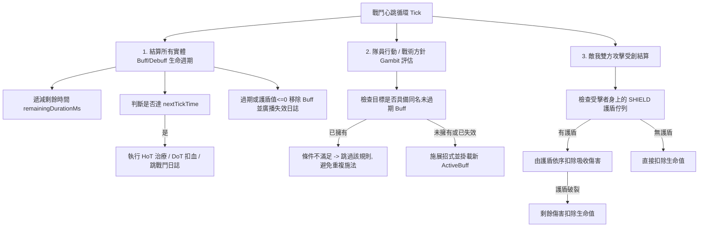

# WoW 風格 Buff / Debuff（狀態效果）體系架構設計與實作規劃

> **版本**：v1.0  
> **建立日期**：2026-09-24  
> **狀態**：規劃中（草案已就緒）  
> **核心哲學**：機制運行 + 資料驅動 + 純粹測試 (Pure Mechanism + Data-Driven + 100% Testable)

---

## 1. 背景與現狀痛點

### 1.1 現狀觀察（如實機戰鬥日誌截圖所示）
在現行 DRPG 戰鬥循環中，當同伴（如百草丹修・凌霜）觸發戰術方針施放【金光辟邪護體】（為前衛肉盾・鐵牛施加辟邪護盾）後：
1. 戰術方針條件（如 `敵方存活數量 >= 2` 或 `敵方存在首領`）在整場戰鬥中持續成立。
2. 系統尚未具備**實體狀態追蹤器（Status Tracker）**，無法感知受法目標身上是否已具備該護盾/增益。
3. 導致凌霜在真元充足且招式冷卻就緒時，於後續回合**重複對鐵牛施放相同的【金光辟邪護體】**，造成無效施法、真元浪費與行動節奏卡頓。

### 1.2 目標願景
借鑒《魔獸世界》（World of Warcraft, WoW）成熟、通用且極具戰術深度的狀態系統（Aura / Buff / Debuff System），建立一套支援**週期性跳算（Tick）、護盾吸收、屬性修飾、控場限制、持續時間與堆疊判定**的標準化機制。

---

## 2. WoW 風格的狀態刷新與堆疊規則 (Stacking & Refresh Rules)

依照玩家指定並參照 WoW 經典規範：

### 2.1 相同技能 / 同名狀態（Same Spell / Same Buff ID）
* **非層數類狀態（護盾 Shield、屬性加成 Stat Buff、持續治療 HoT 等）**：
  * **刷新時間（Refresh Duration）**：若目標已擁有該狀態，手動補施時重置剩餘持續時間至最大值。
  * **護盾刷新原則**：取當前剩餘護盾與新護盾中的較大值（`Math.max(currentShield, newShield)`），**不無限累加厚度**，避免數值無限膨脹。
  * **戰術方針自動防呆（Gambit Recast Prevention）**：
    * 當戰術方針（Gambit AI）評估目標隊員時，若目標身上**已存在同 ID 且未過期/護盾未破的狀態，直接判定條件不滿足**，跳至下一條優先級規則（例如執行普通攻擊或其他輔助道術），**絕不在有效期內盲目重複施放**。
* **可堆疊類狀態（Stacking Buff / Debuff，如毒素 Poison、流血 Bleed、狂暴 Frenzy）**：
  * 若當前層數未達上限（`stacks < maxStacks`），層數遞增（`stacks++`）並刷新持續時間。
  * 若已達最大層數，維持上限並僅刷新持續時間。

### 2.2 不同技能 / 不同狀態（Different Spells / Different Buff IDs）
* **完全共存並疊加（Coexist & Stack）**：
  * **多重護盾疊加吸收**：
    * 凌霜施加的【金光辟邪護體】（辟邪護盾 45 點，持續 20s）與鐵牛自身施展的【不動明王】（金身護盾 54 點，持續 10s）可**同時並存於鐵牛身上**。
    * 當鐵牛受到傷害時，系統依照「先進先出（FIFO）」或「剩餘時間短者優先消耗」佇列依序吸收扣除。
    * *範例*：鐵牛受到 60 點傷害，先完全消耗辟邪護盾 45 點（該 Buff 破裂移除），剩餘 15 點傷害由金身護盾吸收（金身護盾剩餘 39 點繼續保留），鐵牛本體氣血無損！
  * **多重屬性增益共存**：
    * 主角道門陣法加持（防禦 +10%）與丹修祝福丹氣（防禦 +15%）可疊加生效，總防禦提升 +25%。

---

## 3. 領域模型設計 (Domain Model)

### 3.1 狀態類型分類 (`BuffCategory`)
```java
public enum BuffCategory {
  SHIELD,         // 傷害吸收護盾 (如: 金光辟邪護體, 不滅金身)
  HOT,            // 週期性治療 Heal over Time (如: 回春靈霧, 甘露清音)
  DOT,            // 週期性傷害 Damage over Time (如: 幽冥煞毒, 烈火焚身, 裂傷)
  STAT_MODIFIER,  // 屬性增益/減益 (如: 加防、加攻、加氣血上限、降速、破甲)
  CONTROL         // 強制控制 (如: 暈眩 Stun, 定身 Anchored, 混亂 Confused)
}
```

### 3.2 狀態極性 (`BuffType`)
```java
public enum BuffType {
  BUFF,           // 正面增益狀態
  DEBUFF,         // 負面減益狀態
  NEUTRAL         // 中性狀態 (如: 隱匿、假死)
}
```

### 3.3 狀態實體 (`ActiveBuff`)
掛載於所有具備戰鬥生命特性的實體（`PartyMember` 與 `BattleEnemy`）：

```java
@Data
@Builder
@NoArgsConstructor
@AllArgsConstructor
public class ActiveBuff {
  private String id;                    // 狀態 ID (如: buff_gold_shield)
  private String sourceSkillId;          // 來源招式 ID (如: class_cleric_bless)
  private String sourceCasterId;         // 施法者 ID (如: m-ling_shuang)
  private String name;                   // 狀態名稱 (如: 金光辟邪護體)
  private String icon;                   // 圖標符號 (如: 🛡️, 🌿, 🧪, ⚡)
  private BuffType type;                 // BUFF / DEBUFF
  private BuffCategory category;         // SHIELD / HOT / DOT / STAT_MODIFIER / CONTROL
  
  // 生命週期與時間追蹤
  private long durationMs;               // 原始總持續時間 (毫秒)
  private long remainingDurationMs;      // 剩餘時間 (毫秒)
  
  // 週期性心跳 (Tick) 支援
  private long tickIntervalMs;           // Tick 間隔 (如 2000ms = 每 2 秒跳一次)
  private long nextTickTime;             // 下次跳算的時間戳
  
  // 數值與疊加
  private int value;                     // 當前容量 (如護盾剩餘吸收值、每跳基礎治療量)
  private int stacks;                    // 當前層數 (預設 1)
  private int maxStacks;                 // 最大層數 (如 5 層毒)
  
  // 屬性百分比/固定值修正
  @Builder.Default
  private Map<String, Double> statModifiers = new HashMap<>(); 
  
  public boolean isExpired() {
    return remainingDurationMs <= 0 || (category == BuffCategory.SHIELD && value <= 0);
  }
}
```

---

## 4. 資料驅動規格 (Data-Driven JSON Schema)

招式 JSON 檔案擴充 `buff` 節點，由引擎讀取並轉化為狀態，**Java 程式碼中 0 特例判斷**：

### 4.1 護盾類招式範例 (`class_cleric_bless.json`)
```json
{
  "id": "class_cleric_bless",
  "name": "金光辟邪護體",
  "school": "CLERIC",
  "tags": ["CLASS", "BUFF", "SHIELD", "MANA"],
  "costs": { "mp": 35 },
  "mechanics": { "damage": 0 },
  "buff": {
    "id": "buff_gold_shield",
    "name": "金光辟邪護盾",
    "icon": "🛡️",
    "type": "BUFF",
    "category": "SHIELD",
    "durationSeconds": 20,
    "shieldPercentOfTargetHp": 0.25,
    "baseShield": 35,
    "maxStacks": 1
  }
}
```

### 4.2 持續治療類招式範例 (`class_cleric_hot.json` - 回春術)
```json
{
  "id": "class_cleric_spring_rain",
  "name": "春風化雨",
  "school": "CLERIC",
  "tags": ["CLASS", "BUFF", "HOT", "MANA"],
  "buff": {
    "id": "buff_spring_heal",
    "name": "春生靈息",
    "icon": "🌿",
    "type": "BUFF",
    "category": "HOT",
    "durationSeconds": 10,
    "tickIntervalSeconds": 2,
    "healPerTick": 18,
    "healPercentPerTick": 0.05,
    "maxStacks": 1
  }
}
```

### 4.3 持續傷害類招式範例 (`spell_corpse_poison.json` - 煞毒)
```json
{
  "id": "spell_corpse_poison",
  "name": "玄陰屍毒",
  "school": "TAOIST",
  "tags": ["SPELL", "DEBUFF", "DOT"],
  "buff": {
    "id": "debuff_corpse_poison",
    "name": "玄陰屍毒",
    "icon": "🧪",
    "type": "DEBUFF",
    "category": "DOT",
    "durationSeconds": 12,
    "tickIntervalSeconds": 3,
    "damagePerTick": 14,
    "maxStacks": 5
  }
}
```

---

## 5. 戰鬥循環結算流程 (Combat Loop Execution Engine)

在 [DrpgCombatLoop.java](file:///c:/Workspace/my_practice/practice_mud/src/main/java/com/example/htmlmud/domain/dungeon/battle/DrpgCombatLoop.java) 主心跳循環中（每 500ms 一次 Heartbeat）：



---

## 6. 戰術方針條件庫 (Gambit AI) 擴充

為賦予玩家深度客製化能力，戰術條件枚舉 `TacticsCondition` 擴充下列狀態判定條件：

1. **`TARGET_LACKS_BUFF`**（目標缺少指定狀態）：
   * 範例：`前衛隊友 缺少【金光辟邪護盾】 -> 施展【金光辟邪護體】`。
2. **`TARGET_HAS_BUFF`**（目標已擁有指定狀態）：
   * 範例：`當前敵怪 處於【中毒】狀態 -> 施展【猛毒引爆】`。
3. **`BUFF_TIME_LESS_THAN`**（狀態剩餘時間低於 X 秒）：
   * 範例：`自身【不動明王金身】剩餘時間 < 3 秒 -> 重新施展【不動明王】`。
4. **預設防呆原則**：
   * 所有具有 `SHIELD` 或 `BUFF` 標籤的招式，在未特別指定條件時，引擎預設啟動「**目標若已擁有同 ID 狀態則自動掠過**」機制，防止無意義的重複連放。

---

## 7. 前端 UI 與資料傳輸 (DTO & Presentation)

### 7.1 DTO 定義 (`ActiveBuffDto`)
```java
public record ActiveBuffDto(
    String id,
    String name,
    String icon,
    String type,        // BUFF / DEBUFF
    String category,    // SHIELD / HOT / DOT / STAT / CONTROL
    int remainingSeconds,
    int stacks,
    int value           // 當前護盾剩餘值或單次跳血量
) {}
```

### 7.2 前端呈現效果
* **同伴頭像與怪物血條下方**：渲染小膠囊徽章列：
  * `[🛡️ 45 (18s)]` 金光辟邪護體
  * `[⚡ 54 (8s)]` 不動明王金身
  * `[🌿 +18 (6s)]` 春生靈息
  * `[🧪 3層 (9s)]` 玄陰屍毒
* **Tooltip 懸浮浮窗**：滑鼠懸浮時呈現詳細數值、剩餘時間、效果說明與來源施法者。

---

## 8. 分階段實作路徑 (Implementation Roadmap)

1. **Phase 1：核心領域模型與防重複施放（立即痛點解決）**
   * 實作 `ActiveBuff`、`BuffType`、`BuffCategory`。
   * 在 `PartyMember` 與 `BattleEnemy` 建立 `activeBuffs` 容器與護盾抵扣演算法（支援多護盾共存依序吸收）。
   * 在 `DrpgCombatLoop` 與 `DrpgEnemyTacticsService` 加入 **「目標若已有相同 Buff 則不重複施法」** 防呆與同技能刷新時間機制。
2. **Phase 2：心跳 Tick 結算（HoT / DoT / 屬性增益）**
   * 實裝 `processBuffTicks`：週期性跳算回春綠字與中毒紫字。
   * 支援屬性修飾器動態計算（穿脫裝備與 Buff 疊加時重算總防禦/最大氣血）。
3. **Phase 3：前端 UI 視覺化與 Gambit 條件庫擴展**
   * 在戰鬥介面隊友/怪物血條下方渲染動態 Buff 列表與 Tooltip。
   * 新增 `TARGET_LACKS_BUFF`、`TARGET_HAS_BUFF` 戰術方針自訂選項。
4. **Phase 4：全量測試驗證**
   * 驗證多護盾依序吸收、同技能刷新時間、不同技能疊加、HoT/DoT 定時跳算、Gambit 不重複連放。
